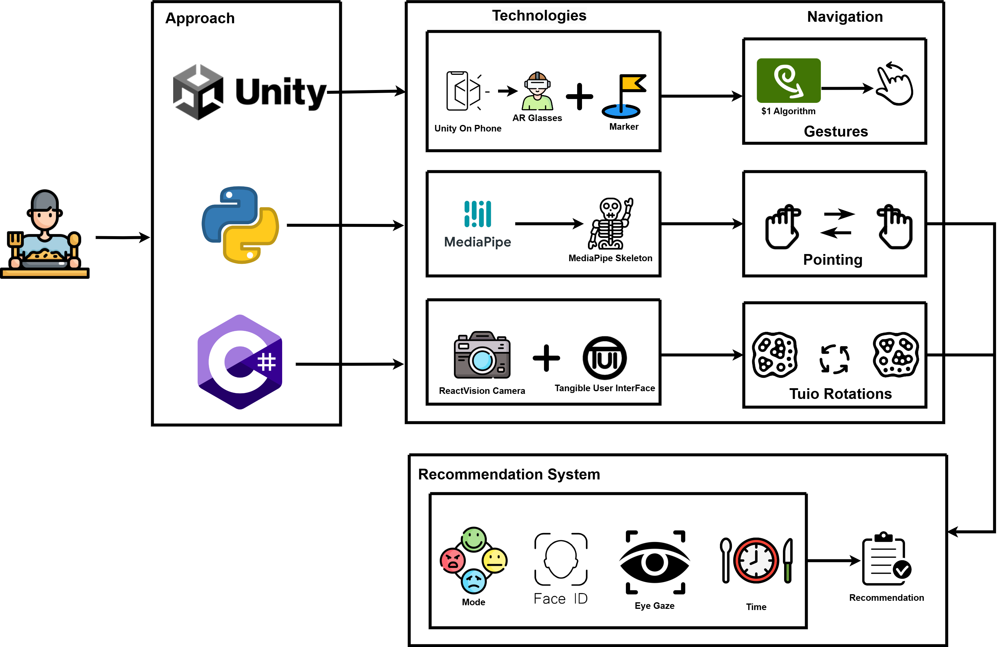
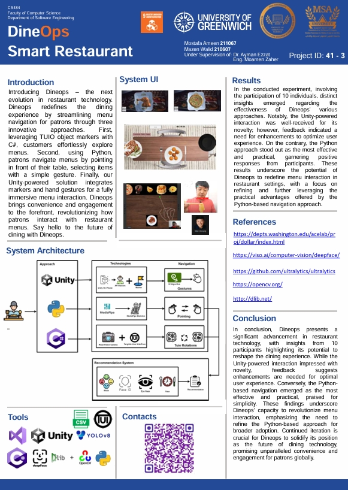

# DineOps - Smart Restaurant Technology

## Table of Contents
1. [Overview](#overview)
2. [System Architecture](#system-architecture)
3. [Technologies and Tools](#technologies-and-tools)
4. [Getting Started](#getting-started)
   - [Prerequisites](#prerequisites)
   - [Installation](#installation)
   - [Running the System](#running-the-system)
5. [File Descriptions](#file-descriptions)
6. [System Poster](#system-poster)
7. [Results](#results)
8. [Conclusion](#conclusion)
9. [Contact](#contact)
10. [Acknowledgment](#acknowledgment)

## Overview

**DineOps** is an innovative restaurant technology system developed as part of a Human-Computer Interaction (HCI) course at university. It aims to revolutionize the dining experience by providing streamlined and interactive menu navigation for patrons. The system is divided into three distinct components:

1. **Python-Based Navigation**: Utilizes gesture recognition to navigate and select menu items by pointing in front of the table.
2. **TUIO Object Markers with C#**: Allows users to interact with menus using object markers.
3. **Unity-Powered Solution**: Combines markers and hand gestures for a fully immersive menu interaction experience.

This repository focuses exclusively on the Python-based navigation component of the DineOps system. 

The TUIO Object Markers with C# version can be found in this [GitHub repository]().

While the Unity-powered solution is available in this [GitHub repository]().

## System Architecture



## Technologies and Tools

The Python-based navigation component utilizes the following technologies and tools:

- **Python**: Powers gesture-based menu navigation.
- **OpenCV**: Handles various computer vision tasks.
- **MediaPipe**: Enables real-time perception.
- **YOLOv8**: Provides object detection capabilities.
- **DeepFace**: Manages facial recognition.
- **Dlib**: Facilitates facial landmark detection.

## Getting Started

### Prerequisites

To run the Python-based navigation component, you will need the following:

- Python 3.x
- OpenCV
- MediaPipe
- YOLOv8
- DeepFace
- Dlib

### Installation

1. Clone the repository:
   ```bash
   git clone https://github.com/mazen251/DineOps-Python.git
   cd DineOps-Python
   ```

2. Install the required libraries:
   ```bash
   pip install -r requirements.txt
   ```

### Running the System

1. Ensure your webcam is connected, as it will be used for gesture recognition.
2. Run the main Python script:
```bash
   python (System 2) & (FR+ ED) Integrated.py
```

The system will launch and use your webcam to detect gestures. Point in front of the table to navigate the menu and select items.

## File Descriptions

- **main.py**: The main script that initializes the system, sets up the webcam, and processes gesture inputs for menu navigation.
- **Face Recognition & Emotion Detection (Dlib, DeepFace).py**: Handles facial recognition and emotion detection using Dlib and DeepFace.
- **System 2.py**: Manages gesture recognition and menu interaction using MediaPipe and OpenCV.
- **Yolo.py**: Uses YOLOv8 for detecting objects within the camera frame to assist with gesture recognition and interaction.
- **Eye Gaze Tracking.py**: Tracks eye gaze to determine where the user is looking, using Dlib and OpenCV.
- **(System 2) & (FR+ ED) Integrated.py**: Integrates the gesture recognition system with facial recognition and emotion detection for enhanced interaction.

## System Poster

The system poster is available as a PDF in the gitAssets directory.



## Results

An experiment involving 10 participants provided valuable insights into the effectiveness of DineOps' different approaches:

- **Unity-Powered Interaction:** Praised for its novelty but requires enhancements for optimal user experience.

- **Python-Based Navigation:** Emerged as the most effective and practical, garnering positive feedback for its simplicity and ease of use.

- **TUIO Object Markers with C#:** Recognized for its intuitive interface but noted for requiring further refinement.

These findings underscore the potential of DineOps to revolutionize menu interaction in restaurant settings, emphasizing the practical advantages of the Python-based navigation approach while also highlighting areas for improvement in other methods.

## Conclusion

DineOps represents a significant advancement in restaurant technology. Participant feedback highlights its potential to transform the dining experience:

- **Unity-Powered Interaction**: While novel and engaging, it requires further refinement to improve user experience.

- **Python-Based Navigation**: Proven to be the most practical and effective approach, highly appreciated for its simplicity and user-friendliness.

- **TUIO Object Markers with C#:** Offers an intuitive interaction but needs additional development to reach its full potential.

Continuous improvement and iteration are crucial for DineOps to enhance its usability and effectiveness, ensuring it offers convenient and engaging menu interactions for restaurant patrons.

## Contact

For more information, contact:

Mazen Walid [LinkedIn](https://www.linkedin.com/in/mazen-walid-225582208/).

## Acknowledgments

- [Ultralytics](https://github.com/ultralytics/ultralytics)
- [ACELab Dollar Project](https://depts.washington.edu/acelab/proj/dollar/index.html)
- [DeepFace](https://viso.ai/computer-vision/deepface/)
- [OpenCV](https://opencv.org/)
- [dlib](http://dlib.net/)